 

NOTE: This repo is out of date.  Working on updating to the latest Angular 2 now!
Starter Kit for VS2015 + TypeScript-Cordova-SystemJS-Angular2-beta
=========
Visual Studio 2015 project, source code and documentation 

The purpose of this VS2015 project is to provide a simple starter project structure for creating `TypeScript + Cordova + Angular2 beta' apps. 

## Features ##

- Folder structure for JavaScript, HTML, CSS + Cordova
- Angular 2 sample code
- Cordova
- SystemJS
- TypeScript
- Visual Studio 2015 Community
- E2E testing - Protractor sample
- Unit testing - Karma sample
- Test Runner - Jasmine sample
- CI server - Travis-CI sample
- Manage TypeScript definitions - Typings sample
- Distribution Platform - HockeyApp instructions

### Quick Start ###

Once the repository is downloaded, open the `cordova-angular2.sln` to start building apps.  All files will automatically download when opened in VS2015 or when the app is published.

Debug > Android > Ripple is the easiest way to check if everything is working.  

Here's what your build will look like:
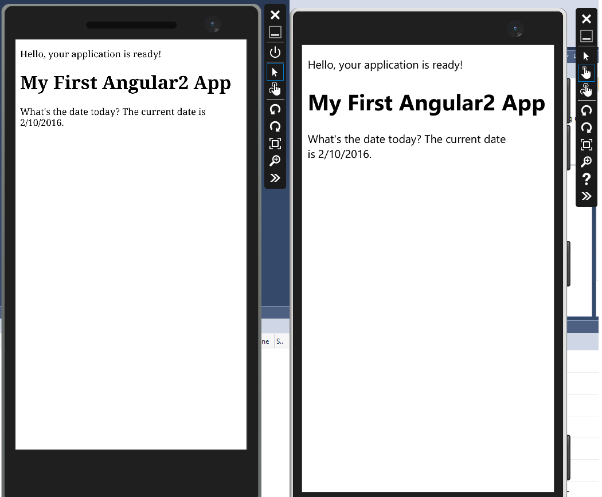

[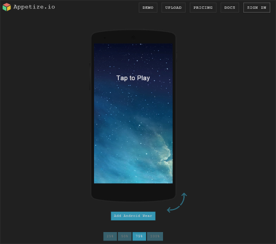](https://appetize.io/app/p860c4y7gf08v4q44eb860vfqm?device=nexus5&scale=75&orientation=portrait&osVersion=6.0)

Click the appetize.io image above to view the app in action. 

## To Do ##

Adding the following

- [X] Add E2E testing framework using Protractor
- [X] Add Unit testing frameworks Karma
- [X] Add Test Runner Jasmine
- [X] Add CI server Travis-CI
- [ ] Add Mock Cordova GPS functionality
- [X] Update folder structure to support Travis CI 
- [ ] Add taco-cli to allow non-VS2015 teams to work together
- [X] Use Typings instead of TSD https://github.com/typings/typings
- [X] Add HockeyApp Update Notifications, Crash Reporting, and Feedback:Android IOS
- [X] <s>Add CodePush quickly push fixes to apps from app stores without re-submitting the entire app</s>* Currently only supports React Native.
- [X] Add instructions on using HockeyApp for Enterprise beta testing.

# Getting Started #

Installing Visual Studio Tools for Apache Cordova
-----------------------

### Visual Studio Community 2015 - install cordova ###

Install the Apache Cordova feature during the VS2015 initital installation or add the feature to VS2015 by using `Add or Remove Programs > select Microsoft Visual Studio Community 2015 ... > Change > modify`. 

Link to download [https://www.visualstudio.com/en-us/products/visual-studio-community-vs.aspx](https://www.visualstudio.com/en-us/products/visual-studio-community-vs.aspx)

Add the Apache Cordova feature by selecting `Cross Platform Mobile Development > HTML/JavaScript (Apache Cordova)` 

### Visual Studio &gt; Extension and Updates ###
Add the following extensions using `Tools > Extensions and updates ....`.  They really help the workflow!

> [Web Essentials 2015](http://vswebessentials.com/) 
> [Open Command Line](https://visualstudiogallery.msdn.microsoft.com/4e84e2cf-2d6b-472a-b1e2-b84932511379)
> [Add New File](https://visualstudiogallery.msdn.microsoft.com/3f820e99-6c0d-41db-aa74-a18d9623b1f3)

### Cordova CLI ###
Teams with Mac's and PC's may find using the TACO CLI easier.
More information about TACO CLI [https://www.npmjs.com/package/taco-cli](https://www.npmjs.com/package/taco-cli)

### Visual Studio Code ###
Cloud based version of Visual Studio.  You can learn more on the website. [https://code.visualstudio.com/](https://code.visualstudio.com/)

# Updating Node #
-------------------
Because Node is such an important part of developing with Cordova, I always try to use the latest version of Node.  That means Node needs to be downloaded separately. 

Note: The gulp files will not load into the Task Runner using the VS2015 default version.  

## Download NODE##
Download the latest version of Node from the link below.  I always have success using the 32 bit version.

[https://nodejs.org/en/](https://nodejs.org/en/)

## Using Node in VS2015 ##
To override the default version of Node, please add `C:\Program Files (x86)\nodejs` into

`Tools > Options > Project and Solutions > External Web Tools`

Make sure to add it in the 2nd position from the top of the list.
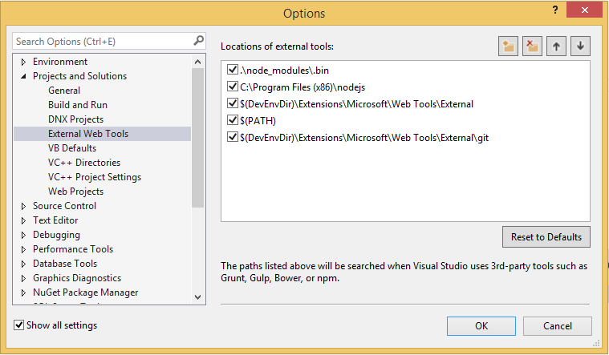

VS2015 will now use this version of Node.

# Updating Cordova Options #
-------------------

The config.xml contains the setting for the Corodova app. It’s also know as the configuration designer. Double click the file in `Solution Explorer` or `right click > View Code`.

### Config.xml > Common

Most of the information is straight forward. Here are some notes:

1.  Update the Common &gt; package name. Best practice: Package name should be reverse-domain style identifier. `io.github.dbiele`

> Update Security for Cordova

1.  Cordova Security: Add external domains to config.xml Domain Access

    1.  Make sure access origin = \*

    2.  Or remove \* and add the names of the domains. <https://*.jspm.io> and <https://*.angularjs.org>. This is used for the index.html script tags

### Config.xml > Platforms

Update to specific versions of Cordova CLI using config.xml. Enter the version number into the text field. When the file is saved, the files are downloaded. You can get the latest version from this URL:
<https://github.com/apache/cordova-cli/releases>

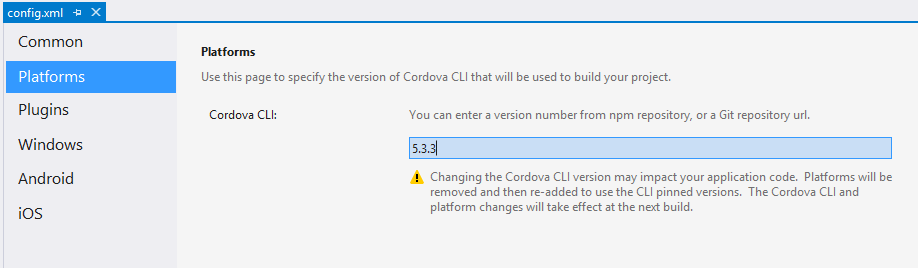

Alternatively you can Npm install –g cordova –s However, config.xml will always override.

### Config.xml > Plugins

I would recommend adding the following plugins:

- Crosswalk

Add Cordova CrossWalk plugin. Config.xml &gt; plugins &gt; Crosswalk Webview. Note, if there’s a problem installing the apk to the device, delete the previous installs on the device.

- Cordova-plugin-whitelist

Add the “cordova-plugin-whitelist” to dependencies in config.xml. Whitelist is a core cordova plugin. Or use NPM to download the files and install locally.
<https://www.npmjs.com/package/cordova-plugin-whitelist>

- Other Popular Plugins
>
-  Cordova-plugin-console
>
-  Cordova-plugin-device
>
-  Cordova-plugin-inappbrowser
>
-  Cordova-plugin-dialogs
>
-  Cordova-plugin-splashscreen
>
-  Cordova-plugin-statusbar

### Config.xml > Windows

Again, this is pretty straightforward.

DisplayName: Use the DisplayName attribute to display a package name to users.

Package Name: Describes the contents of the package. A string between 3 and 50 characters in length that consists of alpha-numeric, period, and dash characters.

Version seems pretty obvious.  Use whatever approach is necessary.  Note: The Version > Revision number must be 0 when publishing for a final release.  Otherwise the app will fail App manifest testing.

Change the Window Target Version to Windows 10.0. Debugging windows phone 8 requires Visual Studio 2013 installed.

### Config.xml > Android

Version Code:
The value is an integer so that other applications can programmatically evaluate it, for example to check an upgrade or downgrade relationship. You can set the value to any integer you want, however you should make sure that each successive release of your application uses a greater value.
More Information: <http://developer.android.com/tools/publishing/versioning.html>
Version Numbering: <http://developer.android.com/about/dashboards/index.html>

*Minimum SDK Version:*
Update Minimum SDK Version to 14. This is because we’ll use cordova-android 4.1.0 or greater.
<http://developer.android.com/guide/topics/manifest/uses-sdk-element.html>

*Maximum SDK Version:*
An integer designating the maximum API Level on which the application is designed to run. If the application's maxSdkVersion attribute is lower than the API Level used by the system itself, then the system will not allow the application to be installed. Future versions of Android (beyond Android 2.0.1) will no longer check or enforce the maxSdkVersion attribute during installation or re-validation. Only used by the google store.

*Target SDK:*
An integer designating the API Level that the application targets. If not set, the default value equals that given to minSdkVersion

### Config.xml > IOS
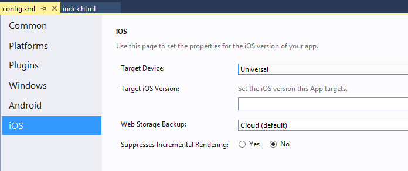
*Target Device*
Set the target device to universal. Setting to a specific device to run application on a specific device or emulator

### config.xml View Code
There are a few things that need to be updated manually.

<author email="dbieledevelop@outlook.com" href="http://dbiele.github.io/">Dean Biele</author> 
Update the email and href as necessary.

*Target iOS Version:*
•iOS SDK 7.0 or later

// TODO: Need more information

*Web Storage Backups:*
Default is good.
Local saves data to NSLibraryDirectory or NSDocumentDirectory and will persist after a backup restore of device. Set to cloud to allow web storage data to backup via iCloud. Set to local to allow only local backups via iTunes sync. Set to none prevent web storage backups.

Update Typescript to latest version
-----------------------------------

Download typescript for Visual Studio 2015

<http://www.microsoft.com/en-us/download/details.aspx?id=48593>
 Click the details button to reveal a list of all version. Download the appropriate version 

Note: Installing the TypeScript CLI does not upgrade Visual Studio 2015 version of TypeScript.

    C:\\Program Files (x86)\\Microsoft SDKs\\TypeScript\\1.5\\tsc
    
    npm install -g typescript
     
    npm install -g typescript@next
     
    tsc –version
     
    where tsc

### Confirm Android SDK Manager is installed ###

Check if you have all the SDK’s by clicking `Tools > Options > Tools for Apache Cordova > Cordova Tools > Run Dependency Checker`.

 Java JDK is installed and using 64bit version. Ie C:\\Program Files\\Java\\jdk1.8.0\_60
 `Tools > Options > Tools for Apache Cordova`

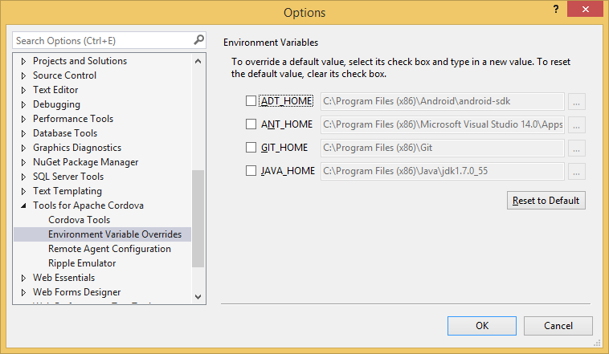

1.  Versions on Cordova can be updated independently. For example, update Cordova-Android to latest version. Instructions on how to do it.
    add to config.xml &lt;engine name="android" spec="4.1.0" /&gt;
    Use these instructions to install globally
    <http://cordova.apache.org/announcements/2015/07/21/cordova-android-4.1.0.html>
    If the project is published, before updating the config.xml then you’ll need to use the command prompt to upgrade the cordova-android version. Use this:
    \`cordova platform remove android\`
    Latest Releases: <https://github.com/apache/cordova-android/releases>

Taco.json
---------

Confirm taco.json has been updated with the latest version of cordova set in config.xml. Taco is used for IOS building and the remote agent uses the CLI version defined in the taco.json.

Tsconfig.json
-------------

Confirm scripts/tsconfig.json exists in scripts folder

1.  Compile with system. Make sure "module": "system" is set in tsconfig.json file.

    {
      "compilerOptions": {
    "noImplicitAny": false,
    "noEmitOnError": true,
    "removeComments": false,
    "sourceMap": true,
    "target": "es5",
    "module": "system",
    "moduleResolution": "node",
    "emitDecoratorMetadata": true,
    "experimentalDecorators": true,
    "outDir": "../www/scripts/"
      },
      "filesGlob": [
    "scripts/**/*.ts",
    "scripts/typings/**/*.d.ts"
      ]
    }

Exclude is another option. However, if exclude is used you must not use “files” object.

    "exclude": \[
    "../docs/md/node\_modules",
    "../docs/md/www"
    \]

Solution Explorer
-----------------

Make sure to show all files in the solution explorer.

Android Keystore
----------------

Add Keystores for Android release builds.

1.  Update build.json to include keystore for releasing to device. Publishing in release mode requires build.json to include keystore.

    1.  Create a keystore and save it locally. Information on how to create keystore
        <https://github.com/Microsoft/cordova-docs/blob/master/articles/tutorial-package-publish/tutorial-package-publish-readme.md>

    2.  Update build.json to include keystore information.

    3.  Note: If errors occur, this may be due to previous version of app on device. Delete app on device and rebuild.

Install d.ts files for TypeScript
---------------------------------

#Using Typings to manage d.ts files
# Install Typings CLI utility.

We need to install `Typings` globally. This is import for Cordova projects. Currently, typings will always install relative to the typings.json.  Installing Typings in `package.json` will only allow us to install types in the root folder.

    npm install typings -g

Note: Remember to use command prompt or powershell as administrator.

## Adding Ambient Typings d.ts files

Open Command Prompt or PowerShell in the `/scripts` folder

    typings install systemjs --ambient --save
    typings install soundjs --ambient --save
    typings install createjs-lib --ambient --save
    typings install preloadjs --ambient --save

More Information: [https://github.com/typings/typings](https://github.com/typings/typings) 

Note: --ambient will install from DefinitelyTyped location

To simplify integration with TypeScript, two files -  typings/main.d.ts  and  typings/browser.d.ts  - are generated which reference all the typings installed in the project only one of which can be used at a time.

## TSD as alternative to Typings
As an alternative to Typings, you can also use TSD to install d.ts files.

1.  Install TSD and configure TSD to manage d.ts files. This only needs to be done once.

    npm install tsd –g

2.  Open the command prompt/powershell at the scripts folder and Install system d.ts file using tsd.

    tsd install systemjs –s

3.  configure TSD to install files in proper location

    1.  Move the tsd.json file to the root of the project

    2.  Change the “path” and “bundle” in tsd.json to point to new folder scripts/typings

    3.  Create TSD task in gulp – see creating tsd gulp task.

    4.  Reinstall d.ts files by running gulp task

Note: When adding new d.ts files with tsd, make sure to open powershell or command line in the same folder as tsd.json.

Delete d.ts files by removing the element from tsd.json and then run `tsd reinstall --clean`

Adding Useful Gulp Tasks
-----------------

### Install gulp-tslint

1.  Add to package.json DevDependencies 

	"gulp-tslint"

2.  Add the following to gulpfile.js:

gulp.task(**'tslint'**, function () {

    // Built-in rules are at
    // https://github.com/palantir/tslint\#supported-rules
    var tslintConfig = {
    "rules": {
    "semicolon": true,
    "requireReturnType": true,
    "requireParameterType": true,
    "jsdoc-format": true,
    "quotemark": \[true, "single"\],
    "variable-name": \[true,"allow-leading-underscore"\]
    }
    };
    
    return gulp.src(\['scripts/\*\*/\*.ts', '!scripts/typings/\*\*'\])
    //Custom rules can be added to configuration. rulesDirectory: 'folder/folder'
    .pipe(tslint({ configuration: tslintConfig }))
    .pipe(tslint.report('verbose', { emitError: true, reportLimit: 0 }));
    });

### Install SASS

1.  Add to package.json devDependencies

    1.  Gulp-sass

    2.  Gulp-autoprefixer

    3.  Es6-promise

2.  Add the following to gulpfile.js

    require('es6-promise').polyfill();
    gulp.task(**'build.css.sass'**, function () {
    gulp.src('./docs/md/scripts/components/materials/components/\*\*/\*.scss')
    // Guilp-Sass runs the pre processor on the .scss files using Sass.
    // Gulp-AutoPrefixer post processes the .css files using PostCSS.
    // CSS and Folder structure is saved to destination folder.
    .pipe(sass().on('error', sass.logError))
    .pipe(prefixer({
    browsers: \['last 2 versions'\],
    cascade: false
    }))
    .pipe(gulp.dest('./docs/md/www/css'));
    > });

### Add install tsd

    gulp.task(**'install.tsd'**, function (callback) {
    ts({
    command: 'reinstall',
    config: './docs/md/tsd.json'
    }, callback);
    });

### Add Browsersync

    var browserSync = require('browser-sync');
    gulp.task(**'browser.sync'**, function () {
    browserSync.init({
    server: {
    baseDir:"./docs/md/www/"
    }
    });

# Updating Index.html #
----------

Update www/index.html

    <meta charset="utf-8" />
    <!--Use the latest engine to render the page and execute JavaScript.-->
    <meta http-equiv="X-UA-Compatible" content="IE=edge,chrome=1" />
    <!--Defines the expiration date and time of the web document-->
    <meta http-equiv="expires" content="wed, 7 Oct 2015 01:00:00 GMT" />
    <!--Initial-scale property controls the zoom level when the page is first loaded.-->
    <meta name="viewport" content="width=device-width, initial-scale=1.0, user-scalable=no" />
    <!--Used as a way to identify mobile websites.-->
    <meta name="HandheldFriendly" content="true">
    <!--If content is set to yes, the web application runs in full-screen mode.-->
    <meta name="apple-mobile-web-app-capable" content="yes">
    <!--If content is set to yes, the web application runs in full-screen mode.-->
    <meta name="apple-mobile-web-app-status-bar-style" content="black">
    <!--Improved highlighting on linked text and images for Windows Phone 8.1-->
    <meta name="msapplication-tap-highlight" content="no">
    <!--telephone numbers in the HTML content will NOT appear as hypertext links-->
    <meta name="format-detection" content="telephone=no">
    <link rel="shortcut icon" href="images/favicon.ico" type="image/x-icon"/>

The following code needs to be added index.html to allow for the CDN’s, Frameworks and JavaScript to work correctly.  This is a security issue.

        Customize the content security policy in the meta tag below as needed. Add 'unsafe-inline' to default-src to enable inline JavaScript.
        For details, see http://go.microsoft.com/fwlink/?LinkID=617521

        More information about Cordova's content security policy:
        https://github.com/apache/cordova-plugin-whitelist/blob/master/README.md#content-security-policy

        Additional Information:
        * gap: is required only on iOS (when using UIWebView) and is needed for JS->native communication
        * https://ssl.gstatic.com is required only on Android and is needed for TalkBack to function properly
        * Disables use of inline scripts in order to mitigate risk of XSS vulnerabilities. To change this:
                * Enable inline JS: add 'unsafe-inline' to default-src
    
    <!--<meta http-equiv="Content-Security-Policy" content="default-src 'self' data: gap: https://ssl.gstatic.com 'unsafe-eval' 'unsafe-inline'; style-src 'self' 'unsafe-inline'; media-src *">-->
    
    <meta http-equiv="Content-Security-Policy" content="default-src https: 'self' *.jspm.io data: gap: https://ssl.gstatic.com 'unsafe-eval' 'unsafe-inline' ws://localhost:*; script-src 'self' 'unsafe-eval' 'unsafe-inline' https://*.jspm.io https://*.angularjs.org; media-src *">

1. Move the cordova.js and platformOverrides.js from the body to the head.

---
    <!-- Cordova reference, this is added to your app when it's built. -->
    
    <!-- platform overrides includes system-polyfills for mobile. platformOverrides.js is located in ./merges folder -->
    

2. Remove the &lt;script src="scripts/appBundle.js"&gt;&lt;/script&gt; . We’ll use systemJS’s system.import to load .js files.

# How to add SystemJS to our project. #

Install systemJS as an NPM package.  Open packge.json and add the following:
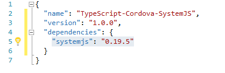

Saving package.json will automatically download the files to the node_modules folder.

1. Locate systemjs in the node_modules folder.  Each NPM package is structured different by the publisher and it’s important to know where the necessary files are located.  
2. Create a folder in the www/scripts folder for where the system .js files will be pasted..  You can organize this however you like.  I suggest using a lib folder and then add a folder for each package.
www/scripts/lib/systemjs/
3. Copy systemjs distribution files to the www folder. 

Update index.html to link to the system.js files in www.

      

Note that I am using system.src.js since it reports more verbose errors.  You can use system.js as well.

### system.config ###
Rather than write the system.config inline in the index.html, create a config.js (`shift + F2`) and place in www\scripts.  Add the following code.

    System.config({
      baseURL: "./scripts",
      defaultJSExtensions: true,
      transpiler: "none",
    });
You can also add inline script tag in index.html

The baseURL is the folder that’s referenced as the root/base of systemjs. 

## Using SystemJS to load external modules. ##

    System.import('index')

‘index’ is the name of the js file that needs to load. Because defaultJSExtensions: true is included in config.js, there is no need to include the .js.  

You can add system.import in index.html, but I prefer to include it in separate .js file.  Better yet, add it to a .ts file and use a script tag in index.html to point to the external .js in the scripts folder

## SystemJS Notes ##
SystemJS doesn't have 100% coverage of comments.  So when making comments in code that transpiles to ES5, be aware that comments may introduce problems 

*Module format detection in SystemJS is not designed to be 100% accurate, it is designed to cater to the majority use case. -- Buy Bedford*

Example:
The following comments don't work.

    // import {enableDebugTools} from 'angular2/platform/browser';
    /**
     * Used to demonstrate external module is loading and function is called.
     */

However, if I change the comments to use the following comment structure, I don't get an error:

    // import {enableDebugTools} from 'angular2/platform/browser';
    // Used to demonstrate external module is loading and function is called.

You can remove comments by changing tsconfig.json  `"removeComments": false,` to `"removeComments": true,`.

## Merges Folder ##

Merges are necessary in Cordova when devices need functionality unique to their ecosystem. For example, windows devices need the system polyfill when using systemjs.

Adding systems-polyfill.js for systemjs

Copy the systems-polyfills.js from the `jspm\_packages &gt; systemjs` folder and copy to `./docs/md/merges/windows/scripts` folder.

Update the code in platformOverrides.js.  platformOverrides.js is added to index.html by default. to add the system-polysills.js to the html. It’s important that system-polyfills loads before system.js in the index.html

Edit the merges &gt; windows &gt; scripts &gt; platformOverrrides.js to include system-polyfills.js

    (function () {
    // Append the safeHTML polyfill
    var scriptElem = document.createElement('script');
    var scriptElem2 = document.createElement('script');
    scriptElem.setAttribute('src', 'scripts/winstore-jscompat.js');
    scriptElem2.setAttribute('src', 'scripts/system-polyfills.js');
    if (document.body) {
    document.body.appendChild(scriptElem);
    document.body.appendChild(scriptElem2);
    } else {
    document.head.appendChild(scriptElem);
    document.head.appendChild(scriptElem2);
    }
    }());

Create mobiledeviceoverride.js
The purpose of mobiledeviceoverride.js was to disable es6-shim.js for mobile devices.  This was originally caused by Angular2 pre beta and mobiledeviceoverride.js was used as a work around.  Now, mobiledeviceoverride.js simple adds es6-shim to the project. es6-shim is necessary for es5 projects.
    

    //var isMobile = navigator.userAgent.match(/Android|BlackBerry|iPhone|iPad|iPod|Opera Mini|IEMobile/i);
    /** 
     * es6-shim is necessary for all browsers.  This was a problem with previous versions on Angular2.
     */
    //if (isMobile != null) {
        console.log('add es6shim');
        var scriptElem = document.createElement('script');
        scriptElem.setAttribute('src', 'scripts/lib/es6-shim/es6-shim.js');
        if (document.body) {
            document.body.appendChild(scriptElem);
        } else {
            document.head.appendChild(scriptElem);
        }
    //}

Updating index.html

    <!-- Add mobile override for es6-shims when using es5 JavaScript.  This was a problem with Angular2 in the past and seems to be fixed.    -->
    
    <!-- adding systemjs -->
    
    

-------------------

# Adding Angular2 beta #
The 5 min quickstart code was added to this project.  You can find the code in `scripts/app.ts` and `scripts/app/app.components.ts`.  Original code [https://angular.io/docs/ts/latest/quickstart.html](https://angular.io/docs/ts/latest/quickstart.html)

### Angular 2 Download with NPM ###
Use NPM to download the latest version of Angular2beta.  Simply add `"angular2": "2.0.0-beta.0"` to the dependencies of package.json.  Saving package.json will automatically download the node_modules.

### Angular2 d.ts files ###
angular2 d.ts files can now be found in the NPM node_modules folder.  There is no need to use TSD to download the files to scripts/typings.  Adding `"module": "system","moduleResolution": "node"` in tsconfig.json resolves the need to have the d.ts files in `./scripts`.

### Updating index.html for Angular 2 ###

    <!-- Add Angular2 -->
    
    <!-- RX filles in the gap since Angular relies on Observables.  Observables are native to es2016 -->
    
    

# Extras #
-------------------
### Disable the Web Bounce Effect ###

Remember to disable the web bounce effect. When scrolling to the bottom of a page, the web view will indicate the bottom by bouncing or flashing.

To stop the effect, use the following in config.xml
 Android, IOS, Windows:

&lt;preference name="disallowOverscroll" value="true" /&gt;
 &lt;preference name="webviewbounce" value="false" /&gt;

### Res Folder Update ###
Platforms specific images and icons are places in the res folders.
Update folder `Res > images`. Res images contains icons and splash screens for resolution specific devices.

### Update icons ### 
 The following windows icons are missing from config.xml.  Create new images and place into the default `res > icon > windows` folder.
Add the following to config.xml
> &lt;icon src="res/icons/windows/Square44x44Logo.scale-100.png" width="44" height="44" /&gt;
> &lt;icon src="res/icons/windows/Square71x71Logo.scale-100.png" width="71" height="71" /&gt;

# General Notes #

May require ADB to install the package manually. Visual Studio 2015 can sometimes create conflicts with devices.
adb install &lt;location of apk file&gt;

List and uninstall APPs on Android device using ADB

1.  Open Command Prompt

2.  CD to the ADB folder

    1.  C:\\Program Files (x86)\\Android\\android-sdk\\platform-tools

3.  Find the app

    1.  adb root

    2.  adb shell

    3.  pm list packages

4.  Uninstall the app

    1.  Adb uninstall &lt;name of package example io.cordova….&gt;

Problems with inline scripts in Windows store app
<https://github.com/MsopenTech/winstore-jscompat> -- add to the html and it will fix document.write by 3rd party javascript.

Publishing: Get it on the device
================================

# Unit Testing #
Unit testing for this starter kit is being done with the Jasmine testing framework and Karma test runner.  

## Overview ##
This start kit is setup for unit tests written in TypeScript, Jasmine and the test runner is  executed using Gulp.  

Tests must be written in the `./scripts/tests/unit` folder and should mirror the same structure as the non-tests folder.  For example, if a .ts file is located in `./scripts/app/components/testings/test.ts` the corresponding unit test should be located in `./scripts/tests/unit/app/components/testings/test.spec.ts`

Unit test file names need to include the .spec.ts in the file name.  Example: `helloworld.spec.ts` Note: The gulpfile.js looks for `.spec.js` when looking for and loading unit test files.

## How to run a e2e test ##
Before running a test, please publish your files so the `www` folder is up to date.  Currently, the files in `www` are tested.  

To run a test using the Karma test runner, run the `unit.test.karma` gulp task.  

###Unit test PASSING ###
When you run the test and it runs successfully, the gulp cli will show the status of the executed tests.  

###Unit test FAILING###
When you run the test and there is a failure, the gulp cli will show the status of the executed tests along with the unit tests `describe` and `it` text.  In addition, the file causing the problem will be listed. I haven't figured out a good way to bug these files with VS2015 and TypeScript, but will post any updates when I find out more. 
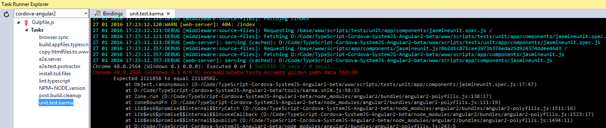 

###Travis CI###
The unit tests can also run on Travis Continuous Integration servers. Alternatively, Visual Studio Team Services has the ability to run CI tests.  Here's good documentation explaining the process:
[https://msdn.microsoft.com/Library/vs/alm/Build/cordova/cordova-build](https://msdn.microsoft.com/Library/vs/alm/Build/cordova/cordova-build)

Place your files on a GitHub Repo, and setup Travis to sync with the repo.  Everytime a new push is done, a new build will be tested on the Travis CI servers.  

Travis CI edits can be made to the .travis.yml folder to customize as necessary.

If you want to make changes to Karma, please update the gulpfile.js, karma.conf.js and karma.shim.js.  

# e2e Testing #

This project is setup for e2e testing using Jasmine and Protractor. The project has a simple test in the `./scripts/tests/e2e` folder to demonstrate e2e in action.

##Overview##
This start kit is setup for e2e tests written in TypeScript, Jasmine and the e2e test runner is executed using Gulp.  

Tests must be written in the `./scripts/tests/e2e` folder and should mirror the same structure as the non-tests folder.  For example, if a .ts file is located in `./scripts/app/components/testings/test.ts` the corresponding unit test should be located in `./scripts/tests/e2e/app/components/testings/test.spec.ts`

## How to run a test ##
Before running any tests, the files must be accessible on a web server. Running the `e2e.server` gulp task will create a web server and host the files with the `.protractor` folder as the root.  Note, the `.protractor` folder is created when the protractor gulp task is run.  More information below.  

 

To run an e2e test, run the `e2e.test.protractor` gulp task.  The task will use all the `*.spec.js` files in the `/scripts/tests/e2e` folder as its test.  The `.protractor` folder is created, content is copied from the `.www` folder and the `./scripts/tests/e2e` .ts files are converted to .js and saved in the .protractor folder.

 

## e2e PASSING##
When the e2e tests pass, Gulp CLI displays the status of each test.
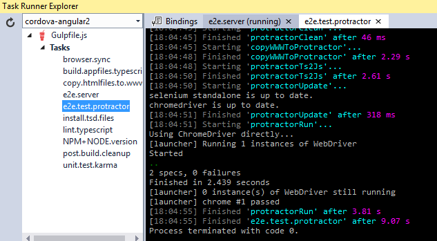 

## e2e FAILING ##
When you run the test and there is a failure, the gulp cli will show the status of the executed tests along with the e2e failing tests `describe` and `it` text.  In addition, the file causing the problem will be listed.
 

-
-

# Loading Audio #
We'll use the CreateJS SoundJS library for working with Audio.

### Audio Plugins ###
Cordova requires the CordovaAudioPlugin class.  The Cordova Media Plugin is required and must be used.

Install the plugins using the `config.xml > plugins`
Add:
- cordova-plugin-media

[https://www.npmjs.com/package/cordova-plugin-media](https://www.npmjs.com/package/cordova-plugin-media)
[http://createjs.com/docs/soundjs/classes/CordovaAudioPlugin.html](http://createjs.com/docs/soundjs/classes/CordovaAudioPlugin.html)

/**
 * @todo Expand description.
 */

## Company Hub / Hockey App ##

Signing App for Hockey App or Company Hub:

"Company app" to refer to a signed application that is intended for private distribution
[https://msdn.microsoft.com/en-us/library/windows/desktop/jj835832(v=vs.85).aspx](https://msdn.microsoft.com/en-us/library/windows/desktop/jj835832(v=vs.85).aspx) 

Location of files:
`\TypeScript-Cordova-SystemJS-Angular2-beta\platforms\windows` 

### Windows Packaging: ###

    Name: io.cordova.myapp52a830
    Publisher: CN=FakeCorp.com, L=Lowell, S=Massachusetts, C=US
    Version: 1.0.0

https://cordova.apache.org/docs/en/6.0.0/guide/platforms/win8/packaging.html 
name and publisher can be set in the config.xml.

    C:\Program Files (x86)\Windows Kits\10\bin\x86
    makecert.exe -n "CN=FakeCorp.com" -r -eku "1.3.6.1.5.5.7.3.3,1.3.6.1.4.1.311.10.3.13" -e "01/01/2020" –h 0 -sv FakeCorp.com.pvk FakeCorp.com.cer

Password = test

Note: I had a problem copying and pasting. I had to type out the root key string into the command prompt.

### Create the self signed pfx file ###
C:\Program Files (x86)\Windows Kits\10\bin\x86

    pvk2pfx -pvk FakeCorp.com.pvk -pi test -spc FakeCorp.com.cer -pfx FakeCorp.com.pfx -po test

### Manually enter users personal certificate ###
    certutil -user -p PASSWORD -importPFX FakeCorp.com.pfx
    certutil -user -p test -importPFX D:\Code\testing_app_package\FakeCorp.com.pfx

### Generate aetx ###
You can only install apps over the air that are signed with your enterprise certificate from Symantec.  Generating a .aetx is only possible with a Symantec certificate
    C:\Program Files (x86)\Microsoft SDKs\Windows Phone\v8.1\Tools\AETGenerator
    AetGenerator.exe D:\Code\testing_app_package\FakeCorp.com.pfx test

### Enterprise Mobile Code-Signing Certificate ###
Symantec is the exclusive provider of code signing certificates for Microsoft App Hub service. Developers and software publishers join App Hub to distribute Windows Phone and Xbox 360 applications for download through Windows Marketplace.

#Using Typings to manage d.ts files
# Install Typings CLI utility.

We need to install `Typings` globally. This is import for Cordova projects. Currently, typings will always install relative to the typings.json

    npm install typings --global

Note: Remember to use command prompt or powershell as administrator.

## Adding Ambient Typings

Open Command Prompt or PowerShell in the `/scripts` folder

    typings install systemjs --ambient --save
    typings install soundjs --ambient --save
    typings install createjs-lib --ambient --save
    typings install preloadjs --ambient --save

Note: --ambient will install from DefinitelyTyped location

To simplify integration with TypeScript, two files -  typings/main.d.ts  and  typings/browser.d.ts  - are generated which reference all the typings installed in the project only one of which can be used at a time.

Using HockeyApp
================================

HockeyApp provides a way to distribute and test Apps without go through the app stores (google play, windows store, apple store).

More info: [http://hockeyapp.net/features/](http://hockeyapp.net/features/)

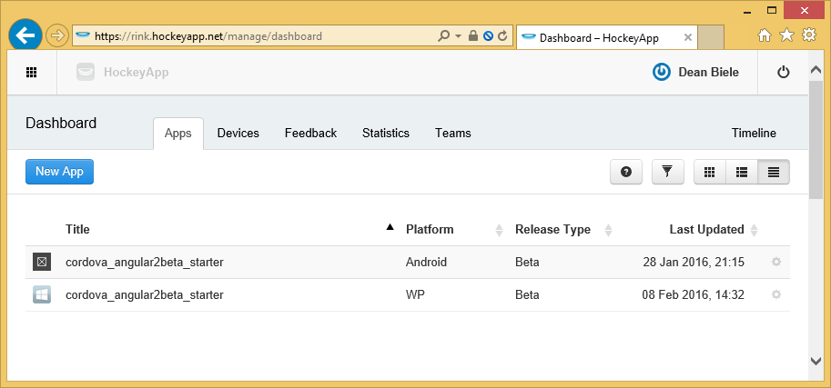 

## Preparing App for upload
Create an app package by selecting the project in Solution Explorer. Right Click the Project > Store > Create App Packages.

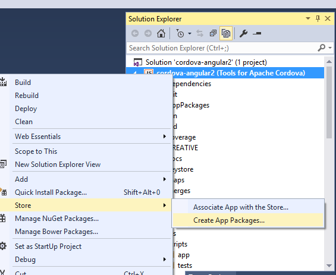 

App Package settings instructions: Good detailed instructions in the link below.
[https://msdn.microsoft.com/en-us/library/windows/apps/xaml/mt627715.aspx#create_package](https://msdn.microsoft.com/en-us/library/windows/apps/xaml/mt627715.aspx#create_package) 

When the packaging is complete, the packaged app will be located in the project root folder `/AppPackages` and the `.appx` file can be used for distribution or sideloading.  The `Add-AppDevPackage.ps1` file can be used on Windows desktops for sideloading.

## Signing for Over the Air Installs
For Windows 8, you can use the the native app and those builds need to be signed with `Symantec` certificate.  The `Symantec` certificate allows an .aetx file to be created. 

An `.aetx` token can only be created if a Enterprise Mobile Code Signing Certificate from `Symantec Corp` has been purchased. Without the certificate, `AetGenerator.exe` is unable to create an .aetx from the .pfx.

Explanation on how to use AETX and Mobile Certificates.
[https://msdn.microsoft.com/en-us/magazine/dn296515.aspx](https://msdn.microsoft.com/en-us/magazine/dn296515.aspx) 

Download Root Certificates [https://knowledge.symantec.com/support/code-signing-support/index?page=content&id=SO20770&actp=search&viewlocale=en_US](https://knowledge.symantec.com/support/code-signing-support/index?page=content&id=SO20770&actp=search&viewlocale=en_US) 

Instructions on how to sign an app [https://msdn.microsoft.com/en-us/library/windows/apps/jj735576(v=vs.105).aspx](https://msdn.microsoft.com/en-us/library/windows/apps/jj735576(v=vs.105).aspx)

## Sideloading Apps

Devices with `developer mode` enabled and unlocked can side load apps. 

The HockeyApp native app currently cant be used to download/install the app. However, you should be able to download the app build (.appx) to the device via the HockeyApp web UI [https://rink.hockeyapp.net/manage/dashboard](https://rink.hockeyapp.net/manage/dashboard).

### Note: The following changes were made to the original project: https://github.com/dbiele/TypeScript-Cordova-SystemJS_no-JSPM : ###

- Add angular2 using NPM and not using TSD to manage d.ts files
- Add gulpfile with common tasks
- copy the angular bundles and platform folder from node_modules to www/scripts/lib/angular2 folder.  Maybe add a build step?
- Add the angular code to index.html
- Changed tsconfig.json to use filesGlob instead of exclude
- Use Cordova CLI 5.3.3.  Cordova CLI greater than 5.3.3 seems to cause problems with Emulators.

    ,
      "exclude": [
    "../node_modules",
    "../www"
      ]
    
Problem running into using Angular2 and Jquery.  d.ts files appear to be the problem.
https://github.com/typings/typings -- is a TSD replacement.

